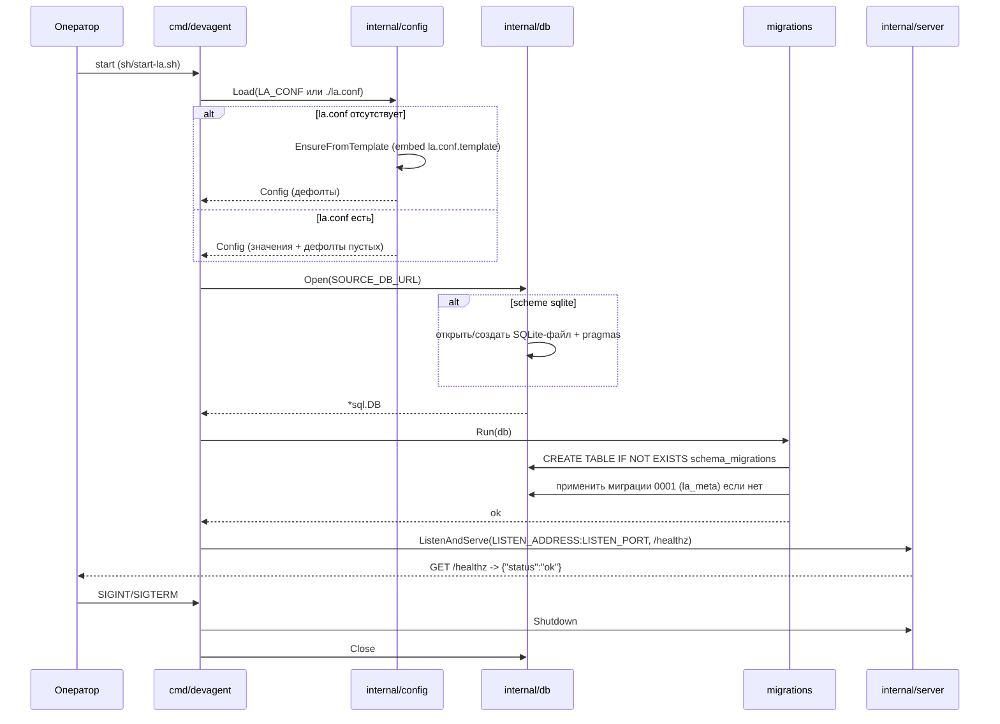

# Спецификация — конфигурация и bootstrap БД (domain: config)

> Источник истины — YAML-блок ниже. Mermaid-диаграмма производна от него и встроена для визуализации.

```yaml
spec_version: 0.1.0
domain: config
us_ref: [US-0001]
project: backend
target: [go]
status: active

summary: >
  При старте backend читает la.conf (создаёт из шаблона при отсутствии),
  подключается к БД по SOURCE_DB_URL (SQLite для MVP, авто-создание файла и схемы),
  применяет миграции (авто-создание объектов при отсутствии) и поднимает
  HTTP на LISTEN_ADDRESS:LISTEN_PORT с эндпоинтом /healthz.

config:
  file: la.conf
  file_override_env: LA_CONF
  template: la.conf.template          # встраивается в бинарник (//go:embed)
  format: KEY=VALUE                   # построчно; '#' — комментарий; пробелы вокруг '=' триммируются
  create_if_absent: true              # из встроенного шаблона
  fields:
    - name: SOURCE_DB_URL
      default: sqlite:la.db
      description: URL подключения к БД; scheme sqlite:<path> | postgres://... (Postgres — позже)
    - name: LISTEN_ADDRESS
      default: localhost
      description: Адрес HTTP-сервера
    - name: LISTEN_PORT
      default: "8888"
      description: Порт HTTP-сервера (строка)

db:
  driver: modernc.org/sqlite          # чистый Go, без CGo
  open:
    - scheme: sqlite
      parse: "sqlite:<path>"
      auto_create_file: true
      pragmas: [journal_mode=WAL, busy_timeout=5000]
    - scheme: postgres                # зарезервировано, НЕ реализуется в этой версии
      status: deferred
  migrations:
    table: schema_migrations          # (version TEXT PRIMARY KEY, applied_at TEXT)
    runner: применяется упорядоченно; пропускает уже записанные; writes applied_at
    idempotent: true
    items:
      - version: "0001"
        description: baseline la_meta
        objects:
          - table: la_meta
            ddl: "CREATE TABLE IF NOT EXISTS la_meta (key TEXT PRIMARY KEY, value TEXT NOT NULL)"

api:
  http:
    listen: "{LISTEN_ADDRESS}:{LISTEN_PORT}"
    endpoints:
      - method: GET
        path: /healthz
        response: { status: ok }
        status: 200
        content_type: application/json
        depends_on: [db.Ping]

runtime:
  process_model: один процесс backend (API + статика frontend — статика позже)
  shutdown: graceful по SIGINT/SIGTERM
  generated_files_not_in_repo: [la.conf, la.db, "*.db", "*.db-*"]

non_functional:
  - SQLite-драйвер — чистый Go, без CGo (сборка штатным go build)
  - Секреты не в репозитории; la.conf/la.db — runtime/сгенерированные (.gitignore)
  - Тесты изолированы (t.TempDir); HTTP-проверка через net/http клиент (без curl/wget)
  - Проверки: go build, go vet, gofmt, go test -race, go test -cover

out_of_scope:
  - Postgres-драйвер (отдельная ЮС)
  - Таблица logs и приём/парсинг логов (ЮС приёма логов, миграция 0002)
  - Полный REST API и Angular-frontend
```

## Диаграмма (производная)

