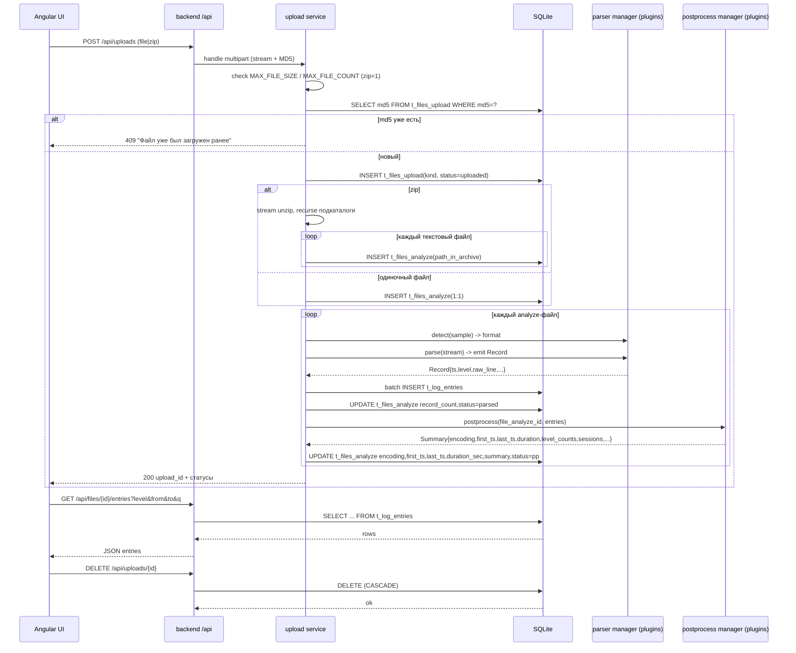

# Спецификация — загрузка и ингестия лог-файлов (domain: ingestion)

> Источник истины — YAML-блок ниже. Mermaid-диаграмма производна. Паттерны форматов выведены из образцов в `sample-logs/` (см. `decisions.parse_patterns`).

```yaml
spec_version: 0.1.0
domain: ingestion
us_ref: [US-0002]
project: [backend, frontend]
target: [go, angular]
status: active
depends_on: [architect/specs/config.spec.md]

summary: >
  Загрузка текстовых лог-файлов (или zip) через веб-интерфейс, автоопределение формата,
  потоковый парсинг подключаемыми парсерами-плагинами, дедуп по MD5 входящего файла,
  сохранение логических записей (multiline-блок = одна строка) в t_log_entries,
  просмотр/повторный анализ/удаление. Без BLOB; хранилище — распарсенные записи (TEXT).

config_additions:            # добавляются в la.conf / la.conf.template (миграция config → 0.2.0)
  - name: MAX_FILE_SIZE
    default: 10GB
    parse: человекочитаемый размер (10GB/512MB) -> байты
    applies_to: входящий файл (одиночный лог или zip-архив)
  - name: MAX_FILE_COUNT
    default: 10
    applies_to: число входящих файлов за один запрос загрузки (zip = 1)
  - name: LA_DEFAULT_TZ
    default: UTC
    applies_to: таймзона для логов без явного смещения (tz_inferred=1)
  - name: LA_PARSERS_DIR
    default: ./parsers
    applies_to: каталог плагинов-парсеров (.so для Go, .py для Python); переопределяет расположение
  - name: LA_POSTPROCESSORS_DIR
    default: ./postprocessors
    applies_to: каталог плагинов-постобработчиков (.so для Go, .py для Python); переопределяет расположение

db:
  driver: modernc.org/sqlite
  migration: "0002"
  tables:
    - name: t_files_upload
      desc: входящие файлы (одиночный лог или zip-архив); дедуп по md5
      columns:
        - { name: id,            type: "TEXT PRIMARY KEY",  note: uuid }
        - { name: filename,      type: "TEXT NOT NULL" }
        - { name: md5,           type: "TEXT NOT NULL UNIQUE", note: дедуп входящего }
        - { name: size_bytes,    type: "INTEGER NOT NULL" }
        - { name: kind,          type: "TEXT NOT NULL", note: "zip | file" }
        - { name: status,        type: "TEXT NOT NULL", note: "uploaded | parsing | parsed | failed | duplicate" }
        - { name: uploaded_at,   type: "TEXT NOT NULL", note: RFC3339 UTC }
        - { name: error,         type: "TEXT" }
      indexes: []
    - name: t_files_analyze
      desc: распакованные/фактические лог-файлы для анализа (1→N от upload)
      columns:
        - { name: id,             type: "TEXT PRIMARY KEY", note: uuid }
        - { name: upload_id,      type: "TEXT NOT NULL", ref: "t_files_upload.id (ON DELETE CASCADE)" }
        - { name: filename,       type: "TEXT NOT NULL" }
        - { name: path_in_archive, type: "TEXT", note: путь внутри zip (подкаталог), NULL для одиночного файла }
        - { name: md5,            type: "TEXT" }
        - { name: format,         type: "TEXT NOT NULL", note: "oracle | weblogic | wls_stdout | java | access | odl | text" }
        - { name: status,         type: "TEXT NOT NULL", note: "pending | parsing | parsed | pp | failed" }
        - { name: record_count,   type: "INTEGER NOT NULL DEFAULT 0" }
        - { name: parsed_at,      type: "TEXT" }
        - { name: encoding,       type: "TEXT", note: определена постобработчиком (UTF-8/Windows-1251/...) }
        - { name: first_ts,        type: "TEXT", note: минимальная ts (UTC) по записям }
        - { name: last_ts,         type: "TEXT", note: максимальная ts (UTC) по записям }
        - { name: duration_sec,    type: "INTEGER", note: last_ts - first_ts в секундах }
        - { name: pp_status,       type: "TEXT", note: "pending | done | failed" }
        - { name: pp_at,           type: "TEXT", note: время завершения постобработки }
        - { name: summary,         type: "TEXT", note: "JSON сводки: level_counts, sessions, extras" }
        - { name: error,          type: "TEXT" }
      indexes:
        - "CREATE INDEX idx_files_analyze_upload ON t_files_analyze(upload_id)"
    - name: t_log_entries
      desc: распарсенные логические записи (одна запись = одна строка; multiline-блок целиком в raw_line)
      columns:
        - { name: id,              type: "INTEGER PRIMARY KEY AUTOINCREMENT" }
        - { name: file_analyze_id, type: "TEXT NOT NULL", ref: "t_files_analyze.id (ON DELETE CASCADE)" }
        - { name: seq,             type: "INTEGER NOT NULL", note: номер записи в файле }
        - { name: format,          type: "TEXT NOT NULL" }
        - { name: ts,              type: "TEXT", note: "UTC ISO8601, NULL если не разобрана" }
        - { name: ts_raw,          type: "TEXT", note: оригинал даты из лога }
        - { name: tz_offset,       type: "TEXT", note: "смещение, напр. +03:00 / Z" }
        - { name: tz_inferred,     type: "INTEGER NOT NULL DEFAULT 0", note: "1 = смещение взято из LA_DEFAULT_TZ" }
        - { name: level,           type: "TEXT", note: "нормализованное: error|warning|info|debug|trace|critical|NULL" }
        - { name: component,       type: "TEXT" }
        - { name: message,          type: "TEXT", note: первая строка/заголовок сообщения }
        - { name: raw_line,        type: "TEXT NOT NULL", note: "полный текст записи incl. multiline (без BLOB)" }
        - { name: attrs,           type: "TEXT", note: "JSON формат-спец. поля (thread, code, status, host...)" }
      indexes:
        - "CREATE INDEX idx_log_entries_file ON t_log_entries(file_analyze_id, seq)"
        - "CREATE INDEX idx_log_entries_ts ON t_log_entries(ts)"
        - "CREATE INDEX idx_log_entries_level ON t_log_entries(level)"

parsers:
  model: plugin
  interface_go: |
    package parser  // release/backend/go/internal/parser
    type Record struct {
      Seq int; Format string
      Ts *time.Time; TsRaw string; TZOffset string; TZInferred bool
      Level string; Component string; Message string
      Raw string; Attrs map[string]any
    }
    type Parser interface {
      Name() string                         // "oracle","weblogic",...
      Detect(sample []string) bool          // sniff первых N строк
      Parse(lines <-chan string, emit func(Record)) error  // потоково
    }
    // плагин (package main) экспортирует: func New() parser.Parser
  interface_py: |
    # release/backend/python/parsers/base.py
    class Record: ...   # те же поля
    class Parser:
      def name(self) -> str
      def detect(self, sample: list[str]) -> bool
      def parse(self, lines, emit)  # потоково, emit(record)
  loading:
    - при старте процесс сканирует LA_PARSERS_DIR; Go — plugin.Open(*.so)->Lookup("New");
      Python — importlib динамически импортирует *.py с классом Parser
    - рестарт процесса допустим (см. NFR); hot-swap в работающем процессе не требуется
    - встроенный парсер text всегда есть в хосте (гарантия fallback)
  detection:
    order: [oracle, weblogic, wls_stdout, java, access, odl]  # плагины; затем built-in text
    method: первый плагин, чей Detect(sample) == true, выигрывает; иначе -> text
    sample_lines: до 20 первых непустых строк файла

  parse_patterns:                 # выведено из sample-logs/
    - name: oracle
      sample: sample-logs/oracle-db/alert_orclcdb.log
      detect: строка строго соответствует ^\d{4}-\d{2}-\d{2}T\d{2}:\d{2}:\d{2}\.\d+[-+]\d{2}:\d{2}$
      record: таймстемп-строка + последующие строки до следующего таймстемпа
      ts: ISO8601 с offset (−04:00) -> UTC; tz_inferred=0
      level: "по контексту: ORA-/Errors/Critical -> error; Warning -> warning; иначе NULL"
      component: NULL (или первая непустая строка-сообщение)
      attrs: "{}"
    - name: weblogic
      sample: [sample-logs/weblogic/AdminServer.log, sample-logs/proxy/proxy.log, sample-logs/weblogic/test_domain.log]
      detect: строка начинается с "####<"
      pattern: "####<{ts}> <{Severity}> <{Subsystem}> <{Machine}> <{Server}> <{Thread}> ... <{Millis}> <{Code}> <{Msg}>"
      record: от одного "####<" до следующего; message может быть multiline
      ts: из поля {Millis} (epoch ms) -> UTC; tz_inferred=0; ts_raw = отображаемый ts; tz_offset = parsed offset если TZ вида GMT+03:00, иначе пусто (аббревиатуру MSK не трактуем)
      level_map: {Info: info, Notice: info, Warning: warning, Error: error, Alert: error, Critical: critical, Emergency: critical, Debug: debug }
      component: Subsystem
      attrs: "{machine, server, thread, code, millis}"
    - name: wls_stdout
      sample: [sample-logs/weblogic/AdminServer.out, sample-logs/weblogic/nodemanager.log, sample-logs/java-general/nodemanager.log]
      detect: строка начинается с "<" и содержит дату вида "<Mon DD, YYYY h:mm AM/PM [TZ]>"
      pattern: "<{ts}> <{LEVEL}> <{Component}> <{Msg}>"
      record: от "<{date}" до следующего
      ts: parse даты; TZ есть и offset-вид -> UTC (tz_inferred=0); TZ аббревиатура/отсутствует -> LA_DEFAULT_TZ (tz_inferred=1)
      variants: также "<YYYY-MM-DD GMT-N HH:MM:SS>" (см. nodemanager) — обрабатывается; не разобрана -> ts=NULL, ts_raw сохранён
      level_map: {SEVERE: error, WARNING: warning, INFO: info, CONFIG: info, FINE: debug, FINER: debug, FINEST: debug}
      component: Component
      attrs: "{}"
    - name: java
      sample: sample-logs/java-general/install.weblogic.log
      detect: ^\d{4}-\d{2}-\d{2} \d{2}:\d{2}:\d{2},\d{3}\s+(INFO|WARN|ERROR|DEBUG|TRACE|FATAL)
      pattern: "{date},{ms} {LEVEL} [{thread}] {logger} - {msg}"
      record: головная строка + continuation (^\s+at |^Caused by:|^\t|^\s+\.\.\. N more) до следующей головной
      ts: дата без TZ -> LA_DEFAULT_TZ (tz_inferred=1)
      level_map: {ERROR: error, FATAL: critical, WARN: warning, INFO: info, DEBUG: debug, TRACE: trace}
      component: logger
      attrs: "{thread, logger}"
    - name: access
      sample: [sample-logs/proxy/access.log, sample-logs/proxy/access.log00001]
      detect: ^\S+ \S+ \S+ \[\d{2}/\w{3}/\d{4}:\d{2}:\d{2}:\d{2} [-+]\d{4}\] "
      pattern: "{host} - {ident} [{date +offset}] \"{method} {path} {proto}\" {status} {size}"
      record: одна строка = одна запись
      ts: "[16/May/2018:18:34:08 +0400] -> UTC; tz_inferred=0"
      level: "из HTTP-статуса: 5xx -> error; 4xx -> warning; иначе info"
      component: "{method} {path}"
      attrs: "{host, method, path, proto, status, size}"
    - name: odl
      sample: sample-logs/weblogic/1/AdminServer-diagnostic.log
      detect: ^\[\d{4}-\d{2}-\d{2}T\d{2}:\d{2}:\d{2}\.\d+[+-]\d{2}:\d{2}\]
      pattern: "[{ts+off}] [{comp}] [{level}] [] [{module}] [tid: {tid}] [userId: {uid}] [ecid: {ecid}] {msg}"
      record: до следующего [ISO8601]; message может содержать блоки [[ ... ]]
      ts: ISO8601 с offset -> UTC; tz_inferred=0
      level_map: {ERROR: error, WARNING: warning, NOTIFICATION: info, TRACE: trace, INFO: info, DEBUG: debug}
      component: comp
      attrs: "{module, tid, userId, ecid}"
    - name: text
      built_in: true
      desc: fallback; одна строка = одна запись; попытка вытянуть дату/уровень из строки, иначе ts/level=NULL
      sample: sample-logs/text-general/domain.ods.wlst.log

  severity_dictionary:   # нормализация в t_log_entries.level
    error:    [Error, Alert, Critical, Emergency, SEVERE, FATAL, ERROR, ORA, "Errors"]
    warning:  [Warning, WARN, WARNING]
    info:     [Info, Notice, NOTIFICATION, INFO, CONFIG, info]
    debug:    [Debug, FINEST, FINE, FINER, debug]
    trace:    [Trace, TRACE]
    critical: [Critical, Emergency, FATAL, critical]

datetime:               # извлечение даты/времени — многоформатное и мультилокальное
  shared_util: true     # общий пакет/модуль разбора дат, используется всеми парсерами
  goal: определить и разобрать datetime в разных форматах и локалях; нормализовать в UTC (ts)
  layouts:             # каталог шаблонов (пробуются по порядку; первый совпавший выигрывает)
    - "2006-01-02T15:04:05.999999-07:00"   # oracle alert.log (ISO8601 + offset)
    - "2006-01-02T15:04:05.999999+07:00"
    - "2006-01-02T15:04:05.999-07:00"      # odl [ISO8601+frac+offset]
    - "02/Jan/2006:15:04:05 -0700"         # access (apache common) [dd/Mon/YYYY:HH:MM:SS +offset]
    - "2006-01-02 15:04:05,000"            # java log4j (мс запятой, без TZ)
    - "Jan 2, 2006 3:04:05 PM MST"         # weblogic .out (12h, TZ abbr/offset)
    - "Jan 2, 2006 3:04:05 PM"             # wls_stdout без TZ
    - "Jan 2, 2006 15:04:05 MST"            # 24h variant
    - "2006-01-02 GMT-3 15:04:05"           # nodemanager variant
    - "Mon Jan 2 15:04:05 MST 2006"         # text-general "Wed Mar 28 16:17:29 GMT-4 2012"
  locales: [en]         # имена месяцев: Jan..Dec / Monday..Sunday (расширяемо; ru/др. — позже)
  tz_handling:
    - offset явный (−04:00, +0700, GMT+03:00) -> UTC, tz_inferred=0
    - TZ аббревиатура (MSK, EST) неоднозначна -> LA_DEFAULT_TZ, tz_inferred=1 (не трактуем аббревиатуры)
    - TZ отсутствует -> LA_DEFAULT_TZ, tz_inferred=1
  fallback: ни один layout не подошёл -> ts=NULL, ts_raw сохраняется, запись всё равно сохраняется
  shared_module_go: release/backend/go/internal/parser/datetime.go
  shared_module_py: release/backend/python/parsers/datetime.py

postprocessors:            # этап после парсинга; параллель парсерам
  stage: "after parse, per t_files_analyze"
  storage: "columns on t_files_analyze (encoding, first_ts, last_ts, duration_sec, summary JSON, pp_status)"
  model: "plugin  # как парсеры: Go .so (buildmode=plugin) / Python .py, в каталоге postprocessors/ (env LA_POSTPROCESSORS_DIR)"
  restart_to_add: true     # рестарт допустим; без пересборки основного бинарника и без повторного развёртывания
  mapping: "postprocessor.Name() совпадает с определённым форматом (oracle->oracle, weblogic->weblogic, ...); если плагина для формата нет -> built-in базовый постобработчик"
  base:                    # базовый постобработчик (built-in, всегда есть) — общая сводка
    fields:
      - total_records   # = record_count
      - file_size       # = t_files_upload.size_bytes (для одиночного) / размер распакованного файла
      - uploaded_at     # из t_files_upload
      - encoding        # определение кодировки (chardet по первым ~64KB)
      - first_ts, last_ts, duration_sec
      - level_counts    # {error:N, warning:N, info:N, debug:N, trace:N, critical:N, unknown:N} по t_log_entries.level
  interface_go: |
    package postprocess  // release/backend/go/internal/postprocess
    type Session struct { StartTs, StopTs string; DurationSec int64; Note string }
    type Summary struct {
      TotalRecords int; FileSize int64; UploadedAt string; Encoding string
      FirstTs, LastTs string; DurationSec int64
      LevelCounts map[string]int; Sessions []Session; Extras map[string]any
    }
    type Postprocessor interface {
      Name() string                                     // "oracle","weblogic",...
      Process(fileAnalyzeID string, entries EntryReader) (Summary, error)  // читает t_log_entries
    }
    type Base struct{}                                  // общая сводка; форматные наследники встраивают Base
    // плагин (package main) экспортирует: func New() postprocess.Postprocessor
  interface_py: |
    # release/backend/python/postprocessors/base.py
    class Session: ...
    class Summary: ...   # те же поля
    class Postprocessor:
      def name(self) -> str
      def process(self, file_analyze_id, entry_reader) -> dict   # наследники расширяют
  inheritance: "форматные постобработчики наследуют от базового и расширяют сводку событиями"
  minimum_extension:     # что форматный наследник обязан добавить к базовой сводке
    - sessions:           # число и интервалы старт-стоп (правила — per формат, см. rules_by_format)
        - count           # число сессий старт-стоп
        - intervals       # длительности интервалов старт-стоп (DurationSec каждой сессии)
    - level_counts        # число сообщений в категориях error/warning/critical/info/debug/...
  rules_by_format:        # что считать стартом/стопом сессии (определяется наследником по образцам)
    oracle:    { start: "Starting ORACLE instance", stop: "Shutting down instance | Instance terminated" }
    weblogic:  { start: "Server state changed to STARTING | ... to RUNNING", stop: "... to SHUTDOWN | ... to FAILED" }
    wls_stdout: "по аналогии с weblogic, если применимо; иначе sessions=[]"
    java:      "start/stop по маркерам приложения (если есть); иначе sessions=[]"
    access:    "sessions не применимы -> sessions=[]; level_counts из HTTP-статусов"
    odl:       "start/stop по диагностическим событиям компонента; иначе sessions=[]"
    text:      "sessions=[]; level_counts если удалось извлечь level"
  extras: "форматные постобработчики могут добавлять формат-спец. поля (attrs Summary.Extras)"

encoding_detection:
  shared_module_go: release/backend/go/internal/parser/encoding.go   # github.com/saintfish/chardet (pure Go)
  shared_module_py: release/backend/python/parsers/encoding.py       # chardet
  method: chardet по первым ~64KB байт -> кодировка; файл декодируется в текст перед парсингом
  stored: t_files_analyze.encoding

api:                       # REST, JSON; префикс /api
  - { method: POST,   path: "/api/uploads",         desc: "multipart: file(s)|zip; MD5-дедуп; лимиты; zip->extract; возвращает upload_id + статусы файлов" }
  - { method: GET,    path: "/api/uploads",          desc: "список загрузок (t_files_upload)" }
  - { method: GET,    path: "/api/uploads/{id}",     desc: "детали загрузки + её analyze-файлы" }
  - { method: DELETE, path: "/api/uploads/{id}",     desc: "удалить загрузку (каскад t_files_analyze, t_log_entries)" }
  - { method: GET,    path: "/api/files",            desc: "список analyze-файлов" }
  - { method: GET,    path: "/api/files/{id}",       desc: "детали файла + record_count + сводка (summary JSON, encoding, first_ts/last_ts/duration_sec, level_counts, sessions)" }
  - { method: GET,    path: "/api/files/{id}/entries", desc: "записи с фильтрами: ?limit&offset&level&from&to&q (поиск по raw/message)" }
  - { method: POST,   path: "/api/files/{id}/postprocess", desc: "пере-запуск постобработки файла (по запросу; обновляет сводку)" }
  - { method: DELETE, path: "/api/files/{id}",       desc: "удалить файл (каскад t_log_entries)" }
  - { method: GET,    path: "/api/parsers",          desc: "список загруженных парсеров (плагины + built-in text)" }

flow:
  upload:
    - 'приём multipart (потоково), потоковый MD5, проверка MAX_FILE_SIZE (входящий) и MAX_FILE_COUNT (zip=1)'
    - 'дедуп: SELECT md5 FROM t_files_upload WHERE md5=? -> если есть: статус duplicate, сообщение "Файл уже был загружен ранее", 409'
    - 'insert t_files_upload(kind=file|zip, status=uploaded)'
    - 'если zip: потоковая распаковка (archive/zip), рекурсивно по подкаталогам; каждый текстовый файл -> t_files_analyze(path_in_archive); архив не хранится'
    - 'если одиночный файл: t_files_analyze 1:1 (path_in_archive=NULL)'
    - 'для каждого t_files_analyze: detect(формат) -> parse(потоково) -> batch INSERT t_log_entries -> UPDATE record_count, status=parsed -> postprocess -> UPDATE encoding,first_ts,last_ts,duration_sec,summary,status=pp'
  parse:
    - 'строки подаются парсеру потоком (bufio); парсер emits Record; хост батчит insert (транзакциями)'
    - 'ts/ts_raw/tz_offset/tz_inferred/level/component/message/raw_line/attrs заполняются парсером'
  postprocess:
    - 'после парсинга каждого файла постобработчик (плагин по формату, иначе built-in base) читает t_log_entries'
    - 'base: total_records, file_size, uploaded_at, encoding (chardet по ~64KB), first_ts/last_ts/duration_sec, level_counts'
    - 'наследники расширяют: sessions (старт/стоп per формат), длительности интервалов, level_counts по категориям; Extras — формат-спец. поля'
    - 'результат -> JSON в t_files_analyze.summary + колонки encoding/first_ts/last_ts/duration_sec; status -> pp'
  view_delete:
    - 'GET списки/детали; DELETE каскад через FK ON DELETE CASCADE'

non_functional:
  - 'MD5 и парсинг потоковые (без загрузки файла в RAM целиком); insert батчами в транзакциях'
  - 'без BLOB; raw_line — длинный TEXT'
  - 'защита от zip-бомб: лимит MAX_FILE_SIZE на входящий архив + (опц.) максимальное число вложенных/суммарный размер (настраивается позже)'
  - 'секреты не в репозитории; la.conf/la.conf.template + .gitignore'
  - 'плагины парсеров: добавление/модификация без пересборки основного бинарника и без повторного развёртывания продукта; рестарт процесса допустим'
  - 'Python-релиз полного функционала — по запросу (те же таблицы/паттерны/API)'

out_of_scope:
  - 'postgres-парсер (образца нет; плагин позже по образцам)'
  - 'полнотекстовый поиск (FTS5) — пока LIKE по raw/message; FTS — отдельная ЮС'
  - 'сборка релизного ZIP — отдельная ЮС'
  - 'Angular-UI: форма загрузки, списки, просмотр записей, удаление — отдельная frontend-ЮС (по этой спецификации API)'
```

## Диаграмма (производная)

