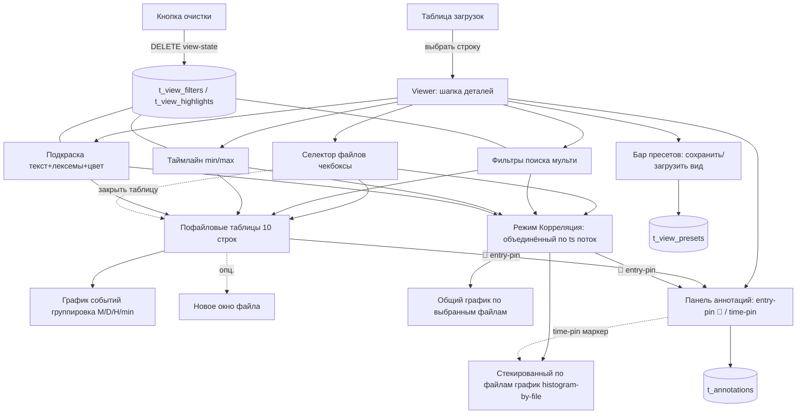

# Спецификация — просмотр и анализ логов (domain: viewer)

> Источник истины — YAML-блок ниже. Mermaid-диаграмма производна. Домен объединяет фронтенд (Angular) и
> бэкенд-поддержку (новые эндпоинты + таблицы персистентности состояния просмотра). ФР фронтенда — из US-0003;
> бэкенд-расширение — US-0004; корреляция по времени между файлами — US-0005; пресеты/аннотации/regex-attrs-поиск/стекированный график — US-0006. Существующие эндпоинты ингестии (US-0002) переиспользуются с расширением параметров.

```yaml
spec_version: 0.3.0
domain: viewer
us_ref: [US-0003, US-0004, US-0005, US-0006]
project: [frontend, backend]
target: [angular, go]
status: active
depends_on: [architect/specs/ingestion.spec.md]

summary: >
  Веб-просмотрщик загруженных логов: таблица загрузок с агрегатами, drill-in в просмотр,
  селектор файлов с чекбоксами, мульти-фильтр поиска по тексту и регулярке + фильтр по attrs,
  таймлайн-селектор по датам, подкраска строк (текст/лексемы + цвет), персистентность фильтров и подкраски между рестартами,
  пофайловые таблицы (пагинация, скрытие/новое окно), график событий с группировкой по времени,
  режим корреляции — объединённый по ts поток событий из нескольких файлов (общий таймлайн) со стекированным по файлам графиком,
  сохранённые view-пресеты (снимок состояния) и аннотации/пин-точки (entry-pin и time-pin).

frontend:
  framework: angular
  build: build-time (Angular CLI -> dist/); в runtime Node не нужен — раздаёт backend
  served_by: backend (Go embed.FS / http.FileServer; Python StaticFiles)
  state_model: состояние просмотра живёт на сервере (таблицы t_view_filters/t_view_highlights), survives restarts
  screens:
    uploads_list:
      desc: "таблица загрузок: сортируемая, фильтруемая"
      columns: [filename, size, uploaded_at, summary_or_files_count, status]
      summary_col: "если kind=file — сводка из t_files_analyze.summary (JSON: level_counts, sessions, ...); если kind=zip — число файлов в архиве"
      row_actions: [delete (каскад: файл + все результаты обработки)]
      below_table: "агрегаты: общий размер хранилища, число загрузок, число файлов, число записей"
    viewer:
      desc: "drill-in из строки загрузки"
      header: "детали архива (kind=zip: число файлов, общий размер, first/last ts) ИЛИ детали одиночного файла"
      sections:
        - file_selector: "список файлов с чекбоксами; по умолчанию выбраны все; чекбокс включает/выключает пофайловую таблицу"
        - search_filters: "поле поиска; режим text (LIKE по вхождению) или regex (серверный REGEXP по полям) + опц. фильтр по attrs (k1:v1,k2:v2 → json_extract); поля all (ts_raw, level, component, message, raw_line) или raw; поиск во всех файлах селектора; несколько фильтров, каждый удаляется независимо; чипы с бейджами [regex]/[attrs]"
        - timeline: "таймлайн-селектор (если применимо): мин/макс дата по выборке; границы двигаются; фильтрует по ts"
        - highlight: "поле ввода текста + опц. выбор кластерных лексем лога + виджет цвета; все подходящие строки подкрашиваются; несколько правил подкраски"
        - file_tables: "каждый выбранный файл — отдельная таблица; постранично (10 строк, размер страницы динамически изменяем); таблицы идут одна за другой; над таблицей — имя файла и краткая сводка мелким читаемым шрифтом; таблицу можно закрыть (чекбокс снимается в селекторе); отметить — показать вновь; в каждой строке — кнопка 📌 (закрепить аннотацию на записи, entry-pin)"
        - per_file_chart: "над/рядом с каждой таблицей — график числа событий с переключаемой группировкой месяц/день/час/минута (видеть всплески)"
        - correlation: "режим «Корреляция (общий таймлайн)»: переключатель заменяет пофайловые таблицы единой объединённой таблицей — записи из выбранных файлов, упорядоченные по ts кросс-файл, с колонкой «файл» (цветовая метка, стабильная per файла); применяются таймлайн-окно, активный поиск (text/regex + attrs) и подкраска; над таблицей — стекированный по файлам график событий (`/histogram-by-file`, сегменты по file_analyze_id, цвет из стабильной палитры по индексу); пагинация; кнопка 📌 в строке (entry-pin)"
        - presets: "бар пресетов у хедера: выбор сохранённого пресета + загрузить/удалить + имя + «сохранить вид»; пресет — снимок состояния (searchFilters, timeline, highlights, selectedFileIds, correlateMode, pageSize) на момент сохранения; загрузка заменяет текущее состояние (confirm если highlights/фильтры непусты); правки после сохранения не синхронизируются"
        - annotations: "панель аннотаций/пин-точек: список (тип пина, цель, заметка, цвет, удалить) + форма добавления time-pin (заметка+цвет+datetime); entry-pin инициируется кнопкой 📌 в строке таблицы; dangling entry-pin (файл/запись удалены) — бейдж «вне страницы/удалена»; time-pin отображается вертикальным маркером на стекированном графике"
    new_window:
      desc: "по возможности каждый файл открывается в новом окне, управление — от основной страницы; если таблица открыта в отдельном окне — на основной не показывается"
      control: "основная страница держит реестр открытых окон; закрытие окна возвращает таблицу на основную страницу"

  persistence:
    scope: per upload
    what: [search_filters, timeline_bounds, highlight_rules, file_selection, page_size, view_presets, annotations]
    where: "backend-таблицы (см. backend.persistence); survives restarts процесса"
    clear: "кнопка очистки всего форматирования и фильтров (DELETE view-state) — НЕ затрагивает пресеты и аннотации (они персистентные заметки/явно сохранённые)"

backend:
  reuse_from_ingestion:
    - "GET /api/uploads (список загрузок) — РАСШИРИТЬ: sort, filter, + meta-агрегаты (storage_size, upload_count, file_count, record_count)"
    - "GET /api/uploads/{id} (детали + analyze-файлы) — РАСШИРИТЬ: summary (single-log summary | archive file_count), first_ts/last_ts (timeline bounds)"
    - "DELETE /api/uploads/{id} (каскад t_files_analyze, t_log_entries, t_view_*)"
    - "GET /api/files (список analyze-файлов) — фильтр по upload_id"
    - "GET /api/files/{id} (детали + record_count + сводка)"
    - "GET /api/files/{id}/entries?limit&offset&level&from&to&q (пагинация пофайловой таблицы)"
    - "GET /api/parsers"
  new_endpoints:
    - { method: GET,    path: "/api/uploads/{id}/correlate",   desc: "корреляция по времени: объединённый поток записей из ?files= (по умолчанию все файлы загрузки), ORDER BY ts IS NULL, ts, seq кросс-файл, с file_analyze_id и filename (JOIN t_files_analyze); фильтры ?from=&to=&q=&mode=&attrs=&level=; пагинация ?limit=&offset=; конверт {items,total,limit,offset} (US-0005; US-0006: +mode/attrs, COUNT-safe)" }
    - { method: GET,    path: "/api/uploads/{id}/search",      desc: "мульти-файловый поиск: ?q=&files=&fields=&mode=text|regex&attrs=&limit&offset; возвращает записи с file_analyze_id; fields=all|raw; mode=regex — серверный REGEXP по полям (OR), невалидный паттерн → 400; attrs=k1:v1,k2:v2 → json_extract LIKE (US-0006)" }
    - { method: GET,    path: "/api/uploads/{id}/lexemes",     desc: "кластерные лексемы для подкраски: ?files=&limit=; топ-термы по выборке" }
    - { method: GET,    path: "/api/uploads/{id}/histogram",    desc: "гистограмма числа событий: ?bucket=month|day|hour|minute&from=&to=&files=; всплески (суммарно)" }
    - { method: GET,    path: "/api/uploads/{id}/histogram-by-file", desc: "стекированная гистограмма (US-0006): ?bucket=&from=&to=&files=; GROUP BY bucket, file_analyze_id → [{bucket, file_analyze_id, count}]; клиент агрегирует в стекированные сегменты" }
    - { method: GET,    path: "/api/uploads/{id}/timeline",     desc: "границы ts по выборке: min_ts, max_ts (для таймлайн-селектора)" }
    - { method: GET,    path: "/api/uploads/{id}/filters",      desc: "сохранённые фильтры поиска/таймлайна (kind=search|timeline, rule JSON; rule search: {q, files, fields, mode, attrs})" }
    - { method: POST,   path: "/api/uploads/{id}/filters",      desc: "создать фильтр (kind, rule)" }
    - { method: DELETE, path: "/api/uploads/{id}/filters/{fid}", desc: "удалить один фильтр (независимо)" }
    - { method: GET,    path: "/api/uploads/{id}/highlights",   desc: "сохранённые правила подкраски (text, color, lexeme)" }
    - { method: POST,   path: "/api/uploads/{id}/highlights",   desc: "создать правило подкраски" }
    - { method: DELETE, path: "/api/uploads/{id}/highlights/{hid}", desc: "удалить одно правило подкраски" }
    - { method: GET,    path: "/api/uploads/{id}/presets",      desc: "сохранённые view-пресеты (US-0006): список {id, name, snapshot JSON, created_at}" }
    - { method: POST,   path: "/api/uploads/{id}/presets",      desc: "создать пресет {name, snapshot}; snapshot — JSON-снимок состояния просмотра" }
    - { method: DELETE, path: "/api/uploads/{id}/presets/{pid}", desc: "удалить пресет" }
    - { method: GET,    path: "/api/uploads/{id}/annotations",  desc: "аннотации/пин-точки (US-0006): список {id, file_analyze_id, entry_id, ts, note, color, created_at}; nullable → JSON null" }
    - { method: POST,   path: "/api/uploads/{id}/annotations",  desc: "создать аннотацию {note, color, (ts | file_analyze_id+entry_id)}; note+color обязательны; ровно один тип пина; смешанное/половинчатое → 400" }
    - { method: DELETE, path: "/api/uploads/{id}/annotations/{aid}", desc: "удалить аннотацию" }
    - { method: DELETE, path: "/api/uploads/{id}/view-state",   desc: "очистить все фильтры и подкраску загрузки (кнопка очистки); НЕ затрагивает пресеты и аннотации" }
    - { method: GET,    path: "/api/stats",                     desc: "агрегаты для таблицы загрузок: storage_size, upload_count, file_count, record_count" }
  persistence:
    migrations: ["0003", "0004"]
    tables:
      - name: t_view_filters
        desc: "сохранённые фильтры просмотра (поиск/таймлайн) per upload; survives restarts"
        columns:
          - { name: id,         type: "TEXT PRIMARY KEY", note: uuid }
          - { name: upload_id,  type: "TEXT NOT NULL", ref: "t_files_upload.id (ON DELETE CASCADE)" }
          - { name: kind,       type: "TEXT NOT NULL", note: "search | timeline" }
          - { name: rule,       type: "TEXT NOT NULL", note: "JSON: {q, files, fields, from, to, ...}" }
          - { name: created_at, type: "TEXT NOT NULL", note: RFC3339 UTC }
        indexes:
          - "CREATE INDEX idx_view_filters_upload ON t_view_filters(upload_id)"
      - name: t_view_highlights
        desc: "сохранённые правила подкраски строк per upload; survives restarts"
        columns:
          - { name: id,         type: "TEXT PRIMARY KEY", note: uuid }
          - { name: upload_id,  type: "TEXT NOT NULL", ref: "t_files_upload.id (ON DELETE CASCADE)" }
          - { name: text,       type: "TEXT NOT NULL", note: "подстрока/паттерн подкраски" }
          - { name: color,      type: "TEXT NOT NULL", note: "цвет (hex/имя)" }
          - { name: lexeme,     type: "INTEGER NOT NULL DEFAULT 0", note: "1 = правило по кластерной лексеме" }
          - { name: created_at, type: "TEXT NOT NULL", note: RFC3339 UTC }
        indexes:
          - "CREATE INDEX idx_view_highlights_upload ON t_view_highlights(upload_id)"
      - name: t_view_presets
        desc: "сохранённые view-пресеты (снимок состояния) per upload (US-0006); survives restarts"
        columns:
          - { name: id,         type: "TEXT PRIMARY KEY", note: uuid }
          - { name: upload_id,  type: "TEXT NOT NULL", ref: "t_files_upload.id (ON DELETE CASCADE)" }
          - { name: name,       type: "TEXT NOT NULL", note: "имя пресета" }
          - { name: snapshot,   type: "TEXT NOT NULL", note: "JSON-снимок: {searchFilters, timeline, highlights, selectedFileIds, correlateMode, pageSize}" }
          - { name: created_at, type: "TEXT NOT NULL", note: RFC3339 UTC }
        indexes:
          - "CREATE INDEX idx_view_presets_upload ON t_view_presets(upload_id)"
      - name: t_annotations
        desc: "аннотации/пин-точки per upload (US-0006); entry-pin (file_analyze_id+entry_id) или time-pin (ts); survives restarts"
        columns:
          - { name: id,                type: "TEXT PRIMARY KEY", note: uuid }
          - { name: upload_id,         type: "TEXT NOT NULL", ref: "t_files_upload.id (ON DELETE CASCADE)" }
          - { name: file_analyze_id,   type: "TEXT", note: "entry-pin цель; БЕЗ FK — dangling допускается (переживает re-ингест)" }
          - { name: entry_id,          type: "INTEGER", note: "entry-pin: id записи; БЕЗ FK — может dangling" }
          - { name: ts,                type: "TEXT", note: "time-pin момент (ISO); null для entry-pin" }
          - { name: note,              type: "TEXT NOT NULL", note: "текст заметки" }
          - { name: color,             type: "TEXT NOT NULL", note: "цвет (hex)" }
          - { name: created_at,        type: "TEXT NOT NULL", note: RFC3339 UTC }
        indexes:
          - "CREATE INDEX idx_annotations_upload ON t_annotations(upload_id)"
          - "CREATE INDEX idx_annotations_ts ON t_annotations(ts)"
  notes:
    - "мульти-файловый поиск и гистограмма — серверная агрегация по выбранным file_analyze_id (параметр files)"
    - "поиск по полям: all (ts_raw, level, component, message, raw_line) | raw (только raw_line — исходное поле)"
    - "режимы поиска (US-0006): text — LIKE по полям; regex — серверная скалярная функция REGEXP (modernc.org/sqlite RegisterScalarFunction, package-level sync.Once + sync.Map-кеш *regexp.Regexp — повторная регистрация на 2+ соединениях в одном процессе); невалидный паттерн → 400 (предкомпиляция regexp.Compile в Go до SQL)"
    - "attrs-фильтр (US-0006): k1:v1,k2:v2 → AND json_extract(attrs, '$.k') LIKE '%v%' (JSON1 встроен в modernc); отсутствующий ключ → NULL → NULL LIKE '%x%' = NULL (falsy) → строка исключена; пустое значение 'k:' → LIKE '%%' (ключ существует); предикат идёт в общий where (COUNT-safe для correlate)"
    - "гистограмма: GROUP BY bucket(ts) по t_log_entries; bucket=month|day|hour|minute; histogram-by-file добавляет GROUP BY file_analyze_id для стекирования"
    - "лексемы: простая частотная кластеризация токенов (без внешних ML-зависимостей в MVP); уточняется в US-0004"
    - "корреляция (US-0005): JOIN t_log_entries × t_files_analyze за filename; ORDER BY ts IS NULL, ts, seq — записи без ts в конце потока (на общий график не попадают, histogram фильтрует ts IS NOT NULL); цвет файла — стабильная палитра по индексу на фронте; US-0006: regex/attrs-предикаты в общем where (COUNT-safe: total и items согласованы)"
    - "пресеты (US-0006): snapshot — снимок на момент сохранения, правки позже не синхронизируются; загрузка заменяет состояние (confirm если highlights/фильтры непусты)"
    - "аннотации (US-0006): entry-pin (file_analyze_id+entry_id, БЕЗ FK — dangling допускается, переживает re-ингест файла; фронт рендерит бейдж «вне страницы/удалена») или time-pin (ts); time-pin → вертикальный маркер на стекированном графике; валидация: note+color обязательны, ровно один тип пина, смешанное/половинчатое → 400; CASCADE по upload_id, но НЕ по file_analyze_id"

non_functional:
  - "Angular — build-time (Node только при сборке -> dist/); в runtime Node не нужен"
  - "состояние просмотра — на сервере (таблицы), survives restarts; не в localStorage браузера как единственный источник"
  - "пофайловые таблицы — пагинация (limit/offset), не грузить все записи в браузер"
  - "мульти-файловый поиск/гистограмма — серверная, потоковая агрегация; лимит по числу файлов/записей"
  - "персистентность per upload: удаление загрузки каскадно чистит t_view_filters/t_view_highlights/t_view_presets/t_annotations"
  - "Python-релиз — те же эндпоинты/таблицы (полный функционал по запросу)"

open_questions:
  - "состав кластерных лексем (алгоритм частотности) — в US-0004 (MVP: топ-N токенов)"
  - "поведение 'новое окно' при невозможности (мобильные/блокировщики) — graceful fallback: таблица на основной"
  - "авторизация/многопользовательность — пока single-tenant; view-state per upload (не per user)"
  - "FTS5 для поиска — пока LIKE/REGEXP (US-0006); полнотекстовый FTS — отдельная ЮС"
  - "пресеты: версионирование/дифф снимков, импорт-экспорт — на потом (MVP: один snapshot на пресет)"
  - "аннотации: группировка/теги, привязка к диапазону ts (не точка) — на потом (MVP: точечные пины)"

out_of_scope:
  - "авторизация и роли"
  - "совместная работа нескольких пользователей над одной загрузкой"
  - "экспорт/печать"
```

## Диаграмма (производная)

